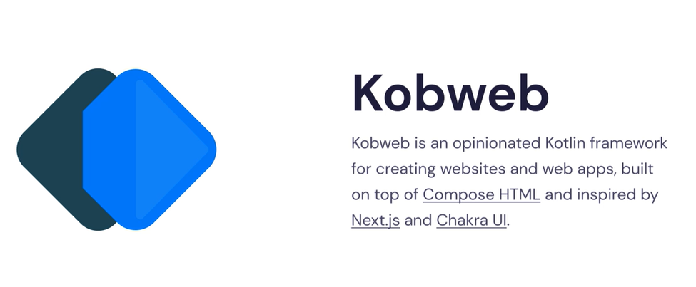
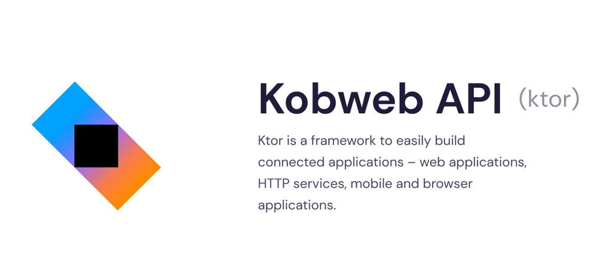
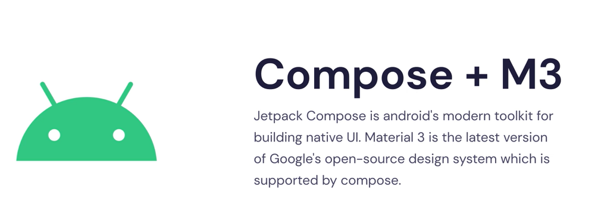

# Kotlin Multiplatform Project

## Notes

- KMP (Kotlin Multiplatform) is used to Target multiple platforms with a single language

- This project following the tutorial shows that you can use KMP to make a Blog Website, Using API, Admin Panel, and an Android App using a Single Codebase (One Source Project)

- [Udemy Course](https://www.udemy.com/course/full-stack-kotlin-multiplatform-kmp-development-web-mobile/) uses jetpack compose 

- Basic knowledge of these tools is used for this type of project

Looks like theirs multiple compose tutorials 1 - desktop, 2 - mobile, 3 - desktop + mobile

1. https://github.com/JetBrains/compose-multiplatform-desktop-template#readme

2. https://github.com/JetBrains/compose-multiplatform-ios-android-template#readme

3. https://github.com/JetBrains/compose-multiplatform-template#readme

Project Highlights
- Key Course Highlights:

- Build a responsive and feature-rich blog website

- Create a powerful API to serve your web and mobile applications

- Design an intuitive admin panel for content creation and management

- Develop a stunning Android app that interacts seamlessly with your backend

- Master Kotlin Multiplatform's code-sharing capabilities

Technologies used:

- Jetpack Compose

- Material 3 Design System

- Kotlin Coroutines

- MongoDB

- KotlinX Serialization

- Kobweb (Compose HTML framework)

- Kobweb API (Ktor server capabilities)

Looks the course uses multiple KMP libraries combined.